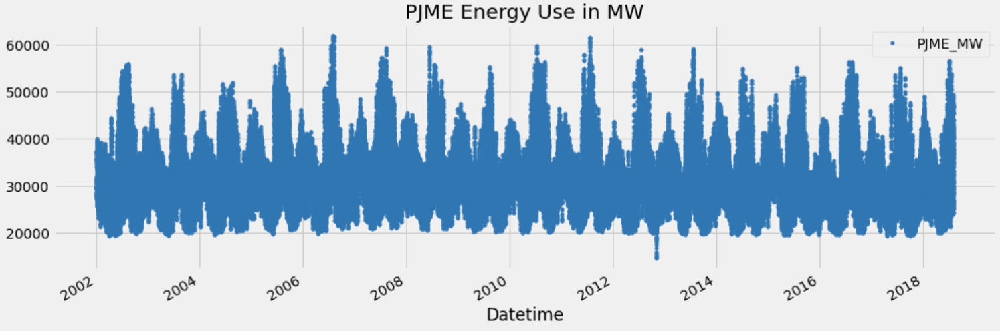

# 🎛️ Energy Consumption Forecast with XGBoost | Time-series ML
  

## 🚀 Overview

> This project implements energy consumption forecasting using XGBoost, a powerful gradient boosting algorithm. 
> Dataset used: <a>https://github.com/panambY/Hourly_Energy_Consumption</a>

- ✅**Simple Version:** Demonstrating the fundamental workflow of a machine learning project.
- ✅**Advanced Version:** Implements sophisticated techniques for improved forecasting accuracy.

---
  
## 📸 How it works?

### 1. Import Data

  
  
  
  

### 2. Preprocessing

  
  

### 3. Train & Evaluate Model

  
  
  

### 4. Predict

  

